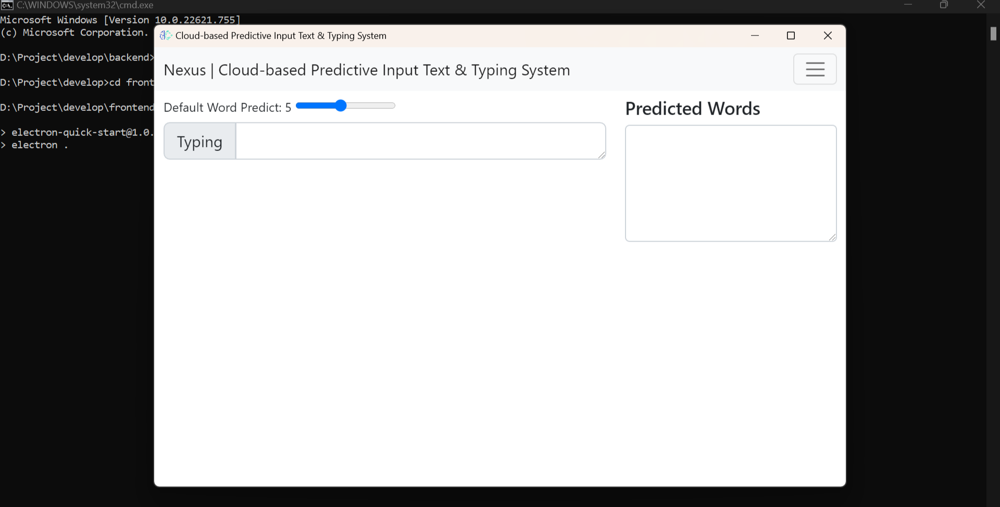
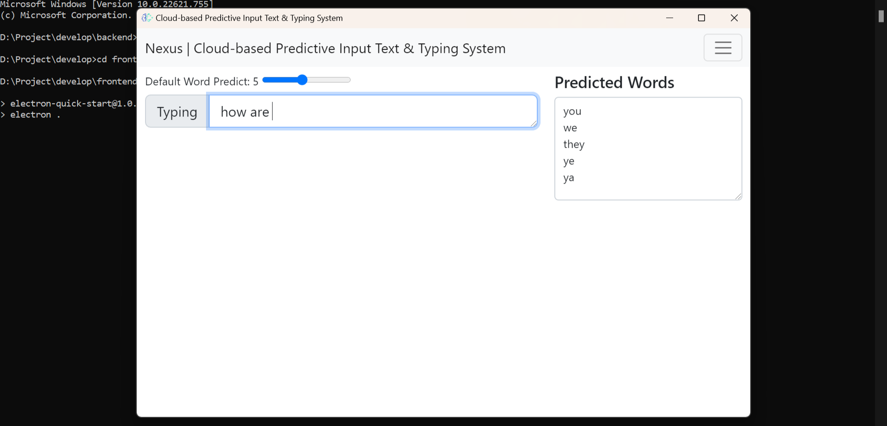

<!-- PROJECT -->
  <h3 align="center">
Cloud-based-Predictive-Input-Text-And-Typing-System
</h3>

  <p align="center">
  (Final Year Project, 2019-23 B.Tech GGITS, Jabalpur)
    <br />
    <a href="https://mudityadev.github.io/mudityadev/"><strong>Muditya Raghav Portflio </strong></a>
  


<!-- TABLE OF CONTENTS -->
<details open="open">
  <summary>Table of Contents</summary>
  <ol>
    <li><a href="#Overview---About-The-Project">Overview - About The Project</a></li>
    <li><a href="#Tools-and-Technique">Tools and Technique</a></li>
    <li><a href="#pipeline">Pipeline</a></li>
    <li>
      <a href="#How-to-Run">How to Run</a>
      <ul>
        <li><a href="#prerequisites">Environment Setup</a></li>
        <li><a href="#installation">Installation of Libraries</a></li>
        <li><a href="#installation">Command on Terminal</a></li>
      </ul>
    </li>
    <li><a href="#More-Screenshots">More Screenshots</a></li>
    <li><a href="#Possible-Improvements">Possible Improvements and Future Work</a></li>
    <li><a href="#contact">Contact</a></li>
  </ol>
</details>


<!-- ABOUT THE PROJECT -->
## Overview - About The Project

Typing on the keyboard is probably the most fundamental way we interact with any computer, or for that matter almost any digital device. Voice recognition and dictation software might replace it someday, but as any Siri user knows, we’re definitely not there yet. 

Nexus Input Method is a cloud-based English language input software which captures English expressions and phrases on the Internet, which enables Nexus Input Method to build a comprehensive and up-to-date vocabulary library. <br>


<!-- Tools -->
## Tools and Technique

* ElectronJS - Cross-Platform Software
* Long-Short Term Memory - Text Prediction
* GPT3 - A variety of natural language tasks  
* Django, Python3 - Backend
* PostgreSQL - Database Management System  

<!-- Pipeline -->
## Pipeline

* Download the software and Install it on pc and mobile
* Create a A/c using Gmail
* Test the typing prediction on workspace
* Give permission to perform prediction on all typing spaces
* Machine translation is well established in the field of automatic error correction(AEC)
* The users are given suggestions of possible next words and in case their needs are not met, they may type their own word.


## How to Run

1. Windows 11 (64 bit ) or Ubuntu 20.04 or 18.04 (Environment)
2. Clone the Nexus-Project
```sh
   git clone https://github.com/mudityadev/Cloud-based-predictive-input-text-and-typing.git
   ```
2. Open Backend directory
 ```sh
   pip3 install -r requirements
   ```
3. Open Frontend directory
 ```sh
   npm install -g
   ```
4. Switch to backend directory
 ```sh
   python app.py
   ```
4. Open frontend directory
 ```sh
   npm start
   ```
5. Nexus Software Start...

<!-- Improvement -->
## More Screenshots
1. Dashboard
   

<br />

2. Loading 
   

<br />

3. Predicting-1
   

<br />

1. Predicting-2


<br />

5. Predicting-3
   

<br />
6. Predicting-4


<br />


6. Predicting-5


<br />


<!-- Improvement -->
## Possible Improvements

1. Switch to mobile-based keyword
2. Integrate with UPI
3. 2-factor authenication of checkout
4. Ads using keyword
5. Nexus’s search techniques to analyze and categorize the most popular words and phrases, and could be a major advantage in Nexus’s future plans for getting the edge in search – more on that later.


<!-- CONTACT -->
## Contact

Muditya Raghav 
* [Muditya Raghav](https://mudityadev.github.io/mudityadev/)
* [Linkedin](https://www.linkedin.com/in/muditya/)
* [Twitter](https://twitter.com/mudityadev)
* [Gmail - rmuditya@gmail.com](rmuditya@gmail.com)
* [Gmail - mudityadev@gmail.com](mudityadev@gmail.com)
